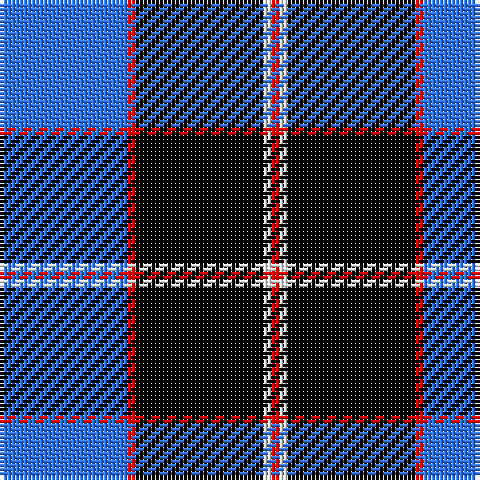

The parent of this is [Christie (2016)](/tartans/b/32/r2/k32/w2/r/2/)

This was sourced from register-of-tartans.  It is a [5 stripes tartan](/stripes/stripes5/).

Original link https://www.tartanregister.gov.uk/tartanDetails.aspx?ref=11640

## Thread count
B/32 R2 K32 W2 R/2

## Palette
Each colour and its ΔE from the base-6 reference it is a variant of.

| Colour | Shade | Base | ΔE (OKLab) |
|---|---|---|---|
| B |  `#3474FC` | B  | 0.23 |
| K |  `#000000` | K  | 0.00 |
| R |  `#FF0000` | R  | 0.11 |
| W |  `#FFFFFF` | W  | 0.03 |

# Sample pattern

ID: /variants/b/32/r2/k32/w2/r/2-b3474fc-k000000-rff0000-wffffff/
