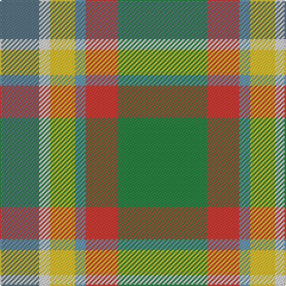

The parent of this is [Montessori School of Denver (School)](/tartans/b/33/ln9/y21/ba9/r27/g/75/)

This was sourced from tartans-authority.  It is a [6 stripes tartan](/stripes/stripes6/).

Original link http://www.tartansauthority.com/tartan-ferret/display/10085/

## Thread count
B/33 LN9 Y21 Ba9 R27 G/75

## Palette
Each colour and its ΔE from the base-6 reference it is a variant of.

| Colour | Shade | Base | ΔE (OKLab) |
|---|---|---|---|
| B |  `#587484` | B  | 0.17 |
| Ba |  `#6898B0` | G  | 0.27 |
| G |  `#288444` | G  | 0.11 |
| LN |  `#E0E0E0` | W  | 0.06 |
| R |  `#CC3C34` | R  | 0.06 |
| Y |  `#E8C000` | Y  | 0.00 |

# Sample pattern

ID: /variants/b/33/ln9/y21/ba9/r27/g/75-b587484-ba6898b0-g288444-lne0e0e0-rcc3c34-ye8c000/
