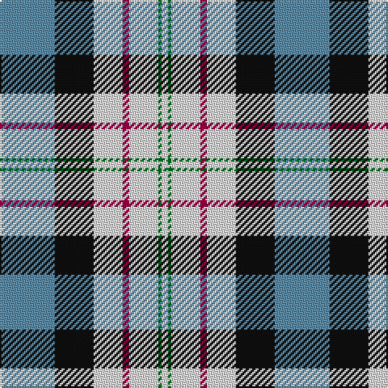

The parent of this is [Ferguson Dress](/tartans/b/34/k24/ln18/r4/ln18/g2/ln/4/)

This was sourced from register-of-tartans.  It is a [7 stripes tartan](/stripes/stripes7/).

Original link https://www.tartanregister.gov.uk/tartanDetails.aspx?ref=1161

## Thread count
B/34 K24 LN18 R4 LN18 G2 LN/4

## Palette
Each colour and its ΔE from the base-6 reference it is a variant of.

| Colour | Shade | Base | ΔE (OKLab) |
|---|---|---|---|
| B |  `#5C8CA8` | B  | 0.23 |
| G |  `#006818` | G  | 0.02 |
| K |  `#101010` | K  | 0.17 |
| LN |  `#E0E0E0` | W  | 0.06 |
| R |  `#980044` | R  | 0.12 |

# Sample pattern

ID: /variants/b/34/k24/ln18/r4/ln18/g2/ln/4-b5c8ca8-g006818-k101010-lne0e0e0-r980044/
