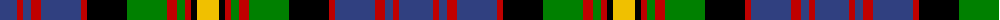

The parent of this is [MacSporran](/tartans/b/34/r6/b8/r10/b40/r6/k40/g40/r10/g8/r6/k6/y/22/)

This was sourced from weddslist.  It is a [13 stripes tartan](/stripes/stripes13/).

Original link http://www.weddslist.com/cgi-bin/tartans/pg.pl?source=sts

## Thread count
B/34 R6 B8 R10 B40 R6 K40 G40 R10 G8 R6 K6 Y/22

## Palette
Each colour and its ΔE from the base-6 reference it is a variant of.

| Colour | Shade | Base | ΔE (OKLab) |
|---|---|---|---|
| B |  `#304080` | B  | 0.01 |
| G |  `#008000` | G  | 0.09 |
| K |  `#000000` | K  | 0.00 |
| R |  `#C00000` | R  | 0.02 |
| Y |  `#F0C000` | Y  | 0.01 |

ID: /variants/b/34/r6/b8/r10/b40/r6/k40/g40/r10/g8/r6/k6/y/22-b304080-g008000-k000000-rc00000-yf0c000/
