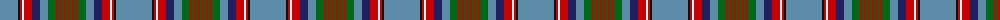

The parent of this is [Hill 70](/tartans/b/36/k2/r2/w2/r8/db8/b8/g8/r2/g2/r2/g2/r2/g/2/)

This was sourced from tartans-authority.  It is a [14 stripes tartan](/stripes/stripes14/).

Original link http://www.tartansauthority.com/tartan-ferret/display/11285/

## Thread count
B/36 K2 R2 W2 R8 DB8 B8 G8 R2 G2 R2 G2 R2 G/2

## Palette
Each colour and its ΔE from the base-6 reference it is a variant of.

| Colour | Shade | Base | ΔE (OKLab) |
|---|---|---|---|
| B |  `#5C8CA8` | B  | 0.23 |
| DB |  `#202060` | B  | 0.11 |
| G |  `#006818` | G  | 0.02 |
| K |  `#101010` | K  | 0.17 |
| R |  `#C80000` | R  | 0.00 |
| W |  `#FCFCFC` | W  | 0.03 |

ID: /variants/b/36/k2/r2/w2/r8/db8/b8/g8/r2/g2/r2/g2/r2/g/2-b5c8ca8-db202060-g006818-k101010-rc80000-wfcfcfc/
