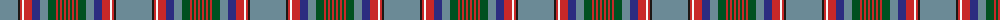

The parent of this is [Hill 70](/tartans/b/36/k2/r2/w2/r8/db8/b8/g8/r2/g2/r2/g2/r2/g/2/)

This was sourced from register-of-tartans.  It is a [14 stripes tartan](/stripes/stripes14/).

Original link https://www.tartanregister.gov.uk/tartanDetails.aspx?ref=11285

## Thread count
B/36 K2 R2 W2 R8 DB8 B8 G8 R2 G2 R2 G2 R2 G/2

## Palette
Each colour and its ΔE from the base-6 reference it is a variant of.

| Colour | Shade | Base | ΔE (OKLab) |
|---|---|---|---|
| B |  `#6B8A96` | G  | 0.23 |
| DB |  `#2C2C80` | B  | 0.05 |
| G |  `#005020` | G  | 0.08 |
| K |  `#1C1714` | K  | 0.21 |
| R |  `#C82828` | R  | 0.03 |
| W |  `#F8F8F8` | W  | 0.01 |

ID: /variants/b/36/k2/r2/w2/r8/db8/b8/g8/r2/g2/r2/g2/r2/g/2-b6b8a96-db2c2c80-g005020-k1c1714-rc82828-wf8f8f8/
