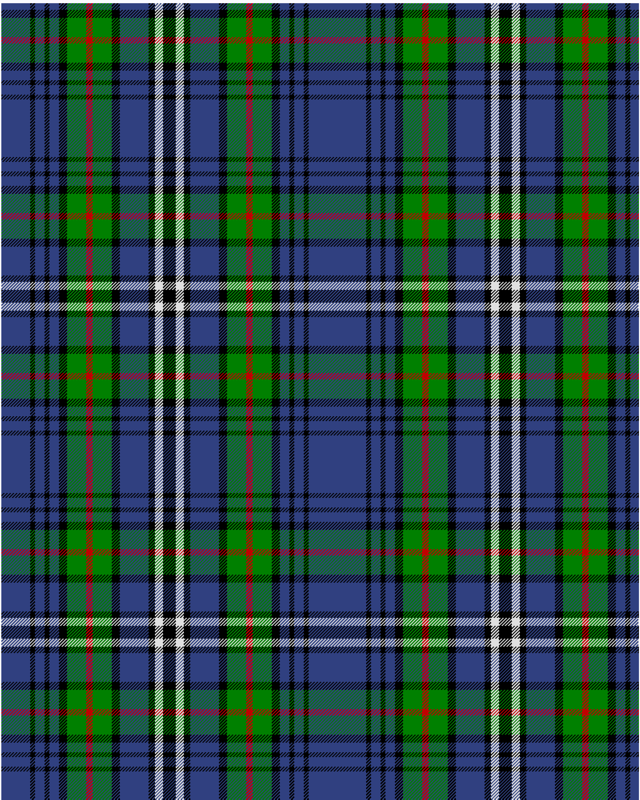

Encyclopedia, Britannica

This was sourced from <no value>.  It is a 14 stripes tartan.

Original link http://www.weddslist.com/cgi-bin/tartans/pg.pl?source=sts

## Thread count
B/36 K6 B12 K6 B12 K10 G24 R8 G24 K10 B36 K8 LN10 K/8

## Palette
B#304080 G#008000 K#000000 LN#E0E0E0 R#C00000

# Sample pattern

ID: /variants/b/36/k6/b12/k6/b12/k10/g24/r8/g24/k10/b36/k8/ln10/k/8-b304080-g008000-k000000-lne0e0e0-rc00000