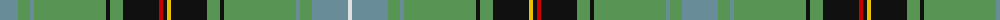

The parent of this is [Rooney Personal Tartan Tartan Number: 7517. Earliest known date: pre 2008 An asymmettic family tartan based on Henderson. Lochcarron sample. Feb 2008. See products available Copyright © Blair Urquhart, Comrie, 2015](/tartans/b/36/lg12/b4/lg72/k4/lg13/k36/r4/k4/y4/k36/lg13/k4/lg72/b4/lg12/b36/ln/4/)

This was sourced from house-of-tartan.  It is a [18 stripes tartan](/stripes/stripes18/).

Original link http://www.house-of-tartan.scotland.net/house/TartanViewjs.asp?colr=Def&tnam=7517

## Thread count
B/36 LG12 B4 LG72 K4 LG13 K36 R4 K4 Y4 K36 LG13 K4 LG72 B4 LG12 B36 LN/4

## Palette
Each colour and its ΔE from the base-6 reference it is a variant of.

| Colour | Shade | Base | ΔE (OKLab) |
|---|---|---|---|
| B |  `#688C98` | G  | 0.23 |
| K |  `#101010` | K  | 0.17 |
| LG |  `#589454` | G  | 0.18 |
| LN |  `#E0E0E0` | W  | 0.06 |
| R |  `#C80000` | R  | 0.00 |
| Y |  `#E8C000` | Y  | 0.00 |

ID: /variants/b/36/lg12/b4/lg72/k4/lg13/k36/r4/k4/y4/k36/lg13/k4/lg72/b4/lg12/b36/ln/4-b688c98-k101010-lg589454-lne0e0e0-rc80000-ye8c000/
