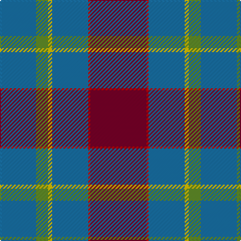

The parent of this is [British Judo Association](/tartans/b/36/lg12/y4/b36/r2/dr/56/)

This was sourced from register-of-tartans.  It is a [6 stripes tartan](/stripes/stripes6/).

Original link https://www.tartanregister.gov.uk/tartanDetails.aspx?ref=11221

## Thread count
B/36 LG12 Y4 B36 R2 DR/56

## Palette
Each colour and its ΔE from the base-6 reference it is a variant of.

| Colour | Shade | Base | ΔE (OKLab) |
|---|---|---|---|
| B |  `#1870A4` | B  | 0.14 |
| DR |  `#780028` | R  | 0.18 |
| LG |  `#608C28` | G  | 0.15 |
| R |  `#C80000` | R  | 0.00 |
| Y |  `#E8C000` | Y  | 0.00 |

# Sample pattern

ID: /variants/b/36/lg12/y4/b36/r2/dr/56-b1870a4-dr780028-lg608c28-rc80000-ye8c000/
