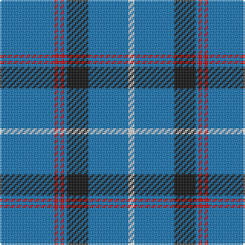

The parent of this is [Tokyo Bluebells (Corporate)](/tartans/b/36/r2/b2/r2/b2/k14/b26/ln/4/)

This was sourced from tartans-authority.  It is a [8 stripes tartan](/stripes/stripes8/).

Original link http://www.tartansauthority.com/tartan-ferret/display/2538/

## Thread count
B/36 R2 B2 R2 B2 K14 B26 LN/4

## Palette
Each colour and its ΔE from the base-6 reference it is a variant of.

| Colour | Shade | Base | ΔE (OKLab) |
|---|---|---|---|
| B |  `#1474B4` | B  | 0.15 |
| K |  `#101010` | K  | 0.17 |
| LN |  `#E0E0E0` | W  | 0.06 |
| R |  `#C80000` | R  | 0.00 |

# Sample pattern

ID: /variants/b/36/r2/b2/r2/b2/k14/b26/ln/4-b1474b4-k101010-lne0e0e0-rc80000/
