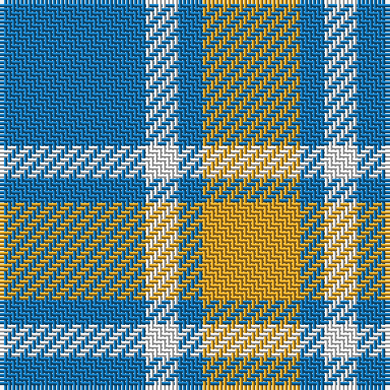

The parent of this is [Genesee Community College](/tartans/b/36/w8/b6/y/24/)

This was sourced from register-of-tartans.  It is a [4 stripes tartan](/stripes/stripes4/).

Original link https://www.tartanregister.gov.uk/tartanDetails.aspx?ref=11468

## Thread count
B/36 W8 B6 Y/24

## Palette
Each colour and its ΔE from the base-6 reference it is a variant of.

| Colour | Shade | Base | ΔE (OKLab) |
|---|---|---|---|
| B |  `#1474B4` | B  | 0.15 |
| W |  `#FFFFFF` | W  | 0.03 |
| Y |  `#E0A126` | Y  | 0.08 |

# Sample pattern

ID: /variants/b/36/w8/b6/y/24-b1474b4-wffffff-ye0a126/
