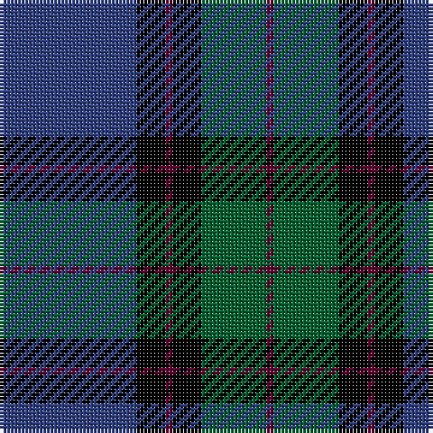

The parent of this is [Monarchs](/tartans/b/38/k8/dr2/k8/g18/dr/2/)

This was sourced from weddslist.  It is a [6 stripes tartan](/stripes/stripes6/).

Original link http://www.weddslist.com/cgi-bin/tartans/pg.pl?source=sts

## Thread count
B/38 K8 DR2 K8 G18 DR/2

## Palette
Each colour and its ΔE from the base-6 reference it is a variant of.

| Colour | Shade | Base | ΔE (OKLab) |
|---|---|---|---|
| B |  `#304080` | B  | 0.01 |
| DR |  `#600030` | B  | 0.19 |
| G |  `#006030` | G  | 0.04 |
| K |  `#000000` | K  | 0.00 |

# Sample pattern

ID: /variants/b/38/k8/dr2/k8/g18/dr/2-b304080-dr600030-g006030-k000000/
