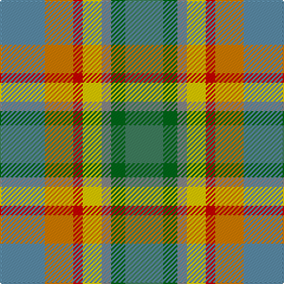

The parent of this is [Aberdeenshire Home Colours](/tartans/b/38/o24/r8/y16/n8/ga12/g/32/)

This was sourced from tartans-authority.  It is a [7 stripes tartan](/stripes/stripes7/).

Original link http://www.tartansauthority.com/tartan-ferret/display/11267/

## Thread count
B/38 O24 R8 Y16 N8 Ga12 G/32

## Palette
Each colour and its ΔE from the base-6 reference it is a variant of.

| Colour | Shade | Base | ΔE (OKLab) |
|---|---|---|---|
| B |  `#5C8CA8` | B  | 0.23 |
| G |  `#408060` | G  | 0.13 |
| Ga |  `#006818` | G  | 0.02 |
| N |  `#888888` | R  | 0.24 |
| O |  `#D87C00` | Y  | 0.17 |
| R |  `#C80000` | R  | 0.00 |
| Y |  `#FCCC00` | Y  | 0.04 |

# Sample pattern

ID: /variants/b/38/o24/r8/y16/n8/ga12/g/32-b5c8ca8-g408060-ga006818-n888888-od87c00-rc80000-yfccc00/
