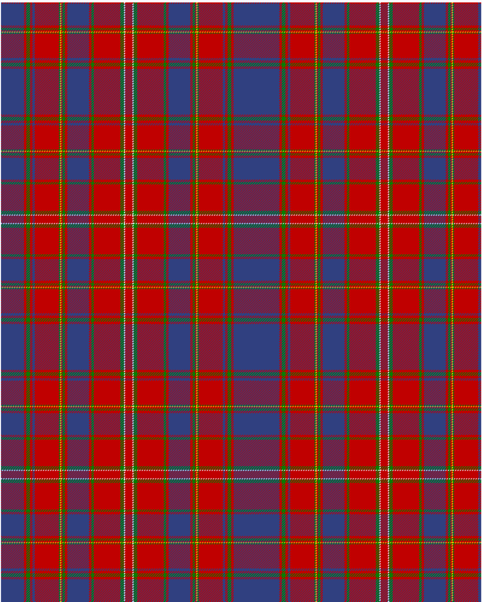

Hebridean, South Uist

This was sourced from <no value>.  It is a 18 stripes tartan.

Original link http://www.weddslist.com/cgi-bin/tartans/pg.pl?source=sts

## Thread count
B/38 R4 G6 R4 B4 R40 G2 Y2 R2 G4 R4 B36 R4 G4 R44 G6 LN2 R/6

## Palette
B#304080 G#008000 LN#E0E0E0 R#C00000 Y#F0C000

# Sample pattern

ID: /variants/b/38/r4/g6/r4/b4/r40/g2/y2/r2/g4/r4/b36/r4/g4/r44/g6/ln2/r/6-b304080-g008000-lne0e0e0-rc00000-yf0c000