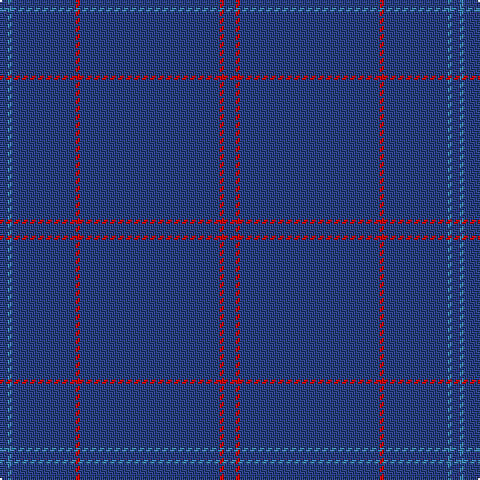

The parent of this is [Lochaber Old](/tartans/b/4/ba2/b32/r2/b70/r2/b/6/)

This was sourced from register-of-tartans.  It is a [7 stripes tartan](/stripes/stripes7/).

Original link https://www.tartanregister.gov.uk/tartanDetails.aspx?ref=2166

## Thread count
B/4 Ba2 B32 R2 B70 R2 B/6

## Palette
Each colour and its ΔE from the base-6 reference it is a variant of.

| Colour | Shade | Base | ΔE (OKLab) |
|---|---|---|---|
| B |  `#2C4084` | B  | 0.00 |
| Ba |  `#3C82AF` | B  | 0.20 |
| R |  `#DC0000` | R  | 0.04 |

# Sample pattern

ID: /variants/b/4/ba2/b32/r2/b70/r2/b/6-b2c4084-ba3c82af-rdc0000/
