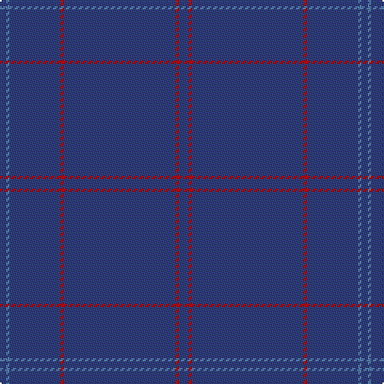

The parent of this is [Lochaber, Old..](/tartans/b/4/ba2/b32/r2/b70/r2/b/6/)

This was sourced from weddslist.  It is a [7 stripes tartan](/stripes/stripes7/).

Original link http://www.weddslist.com/cgi-bin/tartans/pg.pl?source=sts

## Thread count
B/4 Ba2 B32 R2 B70 R2 B/6

## Palette
Each colour and its ΔE from the base-6 reference it is a variant of.

| Colour | Shade | Base | ΔE (OKLab) |
|---|---|---|---|
| B |  `#304080` | B  | 0.01 |
| Ba |  `#5480B0` | B  | 0.20 |
| R |  `#C00000` | R  | 0.02 |

# Sample pattern

ID: /variants/b/4/ba2/b32/r2/b70/r2/b/6-b304080-ba5480b0-rc00000/
