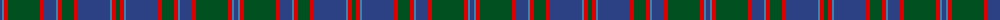

The parent of this is [Glenorchy](/tartans/b/4/ba2/r4/g32/r4/b12/ba2/r4/g12/r4/b32/ba2/r4/g/4/)

This was sourced from register-of-tartans.  It is a [14 stripes tartan](/stripes/stripes14/).

Original link https://www.tartanregister.gov.uk/tartanDetails.aspx?ref=1433

## Thread count
B/4 Ba2 R4 G32 R4 B12 Ba2 R4 G12 R4 B32 Ba2 R4 G/4

## Palette
Each colour and its ΔE from the base-6 reference it is a variant of.

| Colour | Shade | Base | ΔE (OKLab) |
|---|---|---|---|
| B |  `#2C4084` | B  | 0.00 |
| Ba |  `#3C82AF` | B  | 0.20 |
| G |  `#005020` | G  | 0.08 |
| R |  `#DC0000` | R  | 0.04 |

ID: /variants/b/4/ba2/r4/g32/r4/b12/ba2/r4/g12/r4/b32/ba2/r4/g/4-b2c4084-ba3c82af-g005020-rdc0000/
