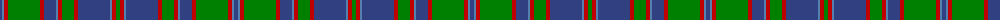

The parent of this is [Glen Orchy](/tartans/b/4/ba2/r4/g32/r4/b12/ba2/r4/g12/r4/b32/ba2/r4/g/4/)

This was sourced from weddslist.  It is a [14 stripes tartan](/stripes/stripes14/).

Original link http://www.weddslist.com/cgi-bin/tartans/pg.pl?source=sts

## Thread count
B/4 Ba2 R4 G32 R4 B12 Ba2 R4 G12 R4 B32 Ba2 R4 G/4

## Palette
Each colour and its ΔE from the base-6 reference it is a variant of.

| Colour | Shade | Base | ΔE (OKLab) |
|---|---|---|---|
| B |  `#304080` | B  | 0.01 |
| Ba |  `#5480B0` | B  | 0.20 |
| G |  `#008000` | G  | 0.09 |
| R |  `#C00000` | R  | 0.02 |

ID: /variants/b/4/ba2/r4/g32/r4/b12/ba2/r4/g12/r4/b32/ba2/r4/g/4-b304080-ba5480b0-g008000-rc00000/
