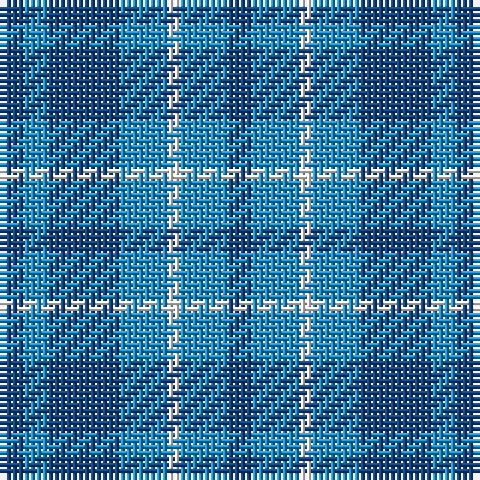

The parent of this is [Langdons](/tartans/b/4/ba4/b12/ba8/w2/ba8/b/4/)

This was sourced from register-of-tartans.  It is a [7 stripes tartan](/stripes/stripes7/).

Original link https://www.tartanregister.gov.uk/tartanDetails.aspx?ref=10103

## Thread count
B/4 Ba4 B12 Ba8 W2 Ba8 B/4

## Palette
Each colour and its ΔE from the base-6 reference it is a variant of.

| Colour | Shade | Base | ΔE (OKLab) |
|---|---|---|---|
| B |  `#144683` | B  | 0.03 |
| Ba |  `#2194D3` | B  | 0.25 |
| W |  `#FFFFFF` | W  | 0.03 |

# Sample pattern

ID: /variants/b/4/ba4/b12/ba8/w2/ba8/b/4-b144683-ba2194d3-wffffff/
