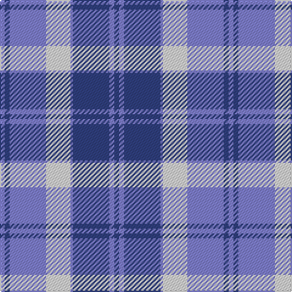

The parent of this is [Bannockbane](/tartans/b/4/ba4/b30/ln20/b2/ba30/b4/ba/4/)

This was sourced from weddslist.  It is a [8 stripes tartan](/stripes/stripes8/).

Original link http://www.weddslist.com/cgi-bin/tartans/pg.pl?source=sts

## Thread count
B/4 Ba4 B30 LN20 B2 Ba30 B4 Ba/4

## Palette
Each colour and its ΔE from the base-6 reference it is a variant of.

| Colour | Shade | Base | ΔE (OKLab) |
|---|---|---|---|
| B |  `#8080D0` | B  | 0.24 |
| Ba |  `#304080` | B  | 0.01 |
| LN |  `#E0E0E0` | W  | 0.06 |

# Sample pattern

ID: /variants/b/4/ba4/b30/ln20/b2/ba30/b4/ba/4-b8080d0-ba304080-lne0e0e0/
