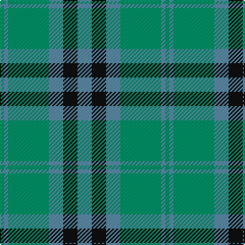

The parent of this is [Falconer of Labhdal (Personal)](/tartans/b/4/ba4/b40/ba14/k14/ba/14/)

This was sourced from register-of-tartans.  It is a [6 stripes tartan](/stripes/stripes6/).

Original link https://www.tartanregister.gov.uk/tartanDetails.aspx?ref=1145

## Thread count
B/4 Ba4 B40 Ba14 K14 Ba/14

## Palette
Each colour and its ΔE from the base-6 reference it is a variant of.

| Colour | Shade | Base | ΔE (OKLab) |
|---|---|---|---|
| B |  `#009468` | G  | 0.16 |
| Ba |  `#5C8CA8` | B  | 0.23 |
| K |  `#101010` | K  | 0.17 |

# Sample pattern

ID: /variants/b/4/ba4/b40/ba14/k14/ba/14-b009468-ba5c8ca8-k101010/
