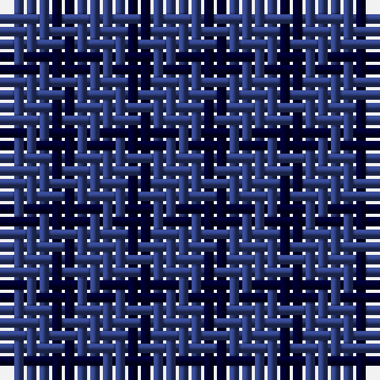

The parent of this is [Tartan Army](/tartans/b/4/db/2/)

This was sourced from weddslist.  It is a [2 stripes tartan](/stripes/stripes2/).

Original link http://www.weddslist.com/cgi-bin/tartans/pg.pl?source=sts

## Thread count
B/4 DB/2

## Palette
B DB

# Sample pattern

ID: /variants/b/4/db/2-b304080-db000030/
