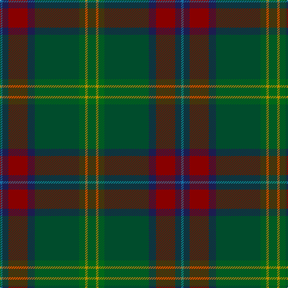

The parent of this is [Telfer Green Name Tartan Tartan Number: 10095. Earliest known date: 2009 A tartan partly inspired by the Hunting Stewart that the designer wears occasionally, and the brooding darkness of the forests. The electric blue stripe is reminiscent of summer lightning across the Scottish landscape, and the sun (gold) is never far away. This tartan is dedicated to all who enjoy nature, trees and plants; to professionals and hobbyists in radio, electronics and communication; and those who are interested in the weather, storms and lightning. Although there are no restrictions, anyone intending to manufacture or use this tartan is encouraged to contact the designer (or his direct descendants) and a choice of preferred charities will be offered for a suggested donation. Copyright of this design belongs to Duncan Telfer. See products available Copyright © Blair Urquhart, Comrie, 2015](/tartans/b/4/db10/dr32/db12/g74/ga10/dy4/ga/14/)

This was sourced from house-of-tartan.  It is a [8 stripes tartan](/stripes/stripes8/).

Original link http://www.house-of-tartan.scotland.net/house/TartanViewjs.asp?colr=Def&tnam=10095

## Thread count
B/4 DB10 DR32 DB12 G74 Ga10 DY4 Ga/14

## Palette
Each colour and its ΔE from the base-6 reference it is a variant of.

| Colour | Shade | Base | ΔE (OKLab) |
|---|---|---|---|
| B |  `#1870A4` | B  | 0.14 |
| DB |  `#1C1C50` | B  | 0.14 |
| DR |  `#880000` | R  | 0.14 |
| DY |  `#BC8C00` | Y  | 0.16 |
| G |  `#004C2C` | G  | 0.10 |
| Ga |  `#006818` | G  | 0.02 |

# Sample pattern

ID: /variants/b/4/db10/dr32/db12/g74/ga10/dy4/ga/14-b1870a4-db1c1c50-dr880000-dybc8c00-g004c2c-ga006818/
