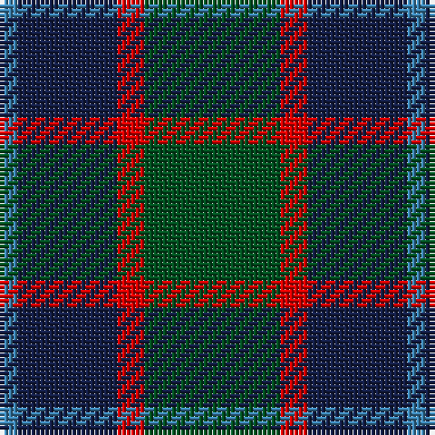

The parent of this is [MacNab](/tartans/b/4/db22/r6/g/30/)

This was sourced from register-of-tartans.  It is a [4 stripes tartan](/stripes/stripes4/).

Original link https://www.tartanregister.gov.uk/tartanDetails.aspx?ref=2664

## Thread count
B/4 DB22 R6 G/30

## Palette
Each colour and its ΔE from the base-6 reference it is a variant of.

| Colour | Shade | Base | ΔE (OKLab) |
|---|---|---|---|
| B |  `#3C82AF` | B  | 0.20 |
| DB |  `#141E46` | B  | 0.15 |
| G |  `#005020` | G  | 0.08 |
| R |  `#DC0000` | R  | 0.04 |

# Sample pattern

ID: /variants/b/4/db22/r6/g/30-b3c82af-db141e46-g005020-rdc0000/
