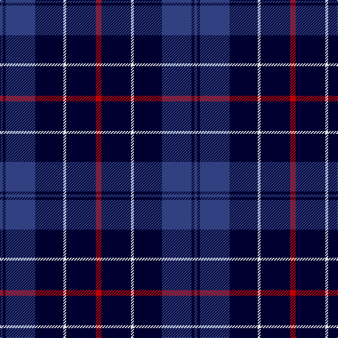

The parent of this is [St. Georges, Edgbaston](/tartans/b/4/db4/b42/db40/ln4/db42/r/8/)

This was sourced from weddslist.  It is a [7 stripes tartan](/stripes/stripes7/).

Original link http://www.weddslist.com/cgi-bin/tartans/pg.pl?source=sts

## Thread count
B/4 DB4 B42 DB40 LN4 DB42 R/8

## Palette
Each colour and its ΔE from the base-6 reference it is a variant of.

| Colour | Shade | Base | ΔE (OKLab) |
|---|---|---|---|
| B |  `#304080` | B  | 0.01 |
| DB |  `#000030` | K  | 0.17 |
| LN |  `#E0E0E0` | W  | 0.06 |
| R |  `#C00000` | R  | 0.02 |

# Sample pattern

ID: /variants/b/4/db4/b42/db40/ln4/db42/r/8-b304080-db000030-lne0e0e0-rc00000/
