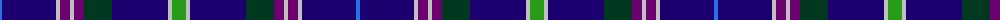

The parent of this is [Head of the Lakes District Canada Tartan Tartan Number: 2241. Earliest known date: 1996 Designed by Joan Forrester Troniak & Fiona Irwin as a District Tartan to comemorate the 25th anniversary of the Ontario city of Thunder Bay which has adopted it. See products available Copyright © Blair Urquhart, Comrie, 2015](/tartans/b/4/db54/n4/p10/n4/p10/dg28/db56/n4/g/14/)

This was sourced from house-of-tartan.  It is a [10 stripes tartan](/stripes/stripes10/).

Original link http://www.house-of-tartan.scotland.net/house/TartanViewjs.asp?colr=Def&tnam=2241

## Thread count
B/4 DB54 N4 P10 N4 P10 DG28 DB56 N4 G/14

## Palette
Each colour and its ΔE from the base-6 reference it is a variant of.

| Colour | Shade | Base | ΔE (OKLab) |
|---|---|---|---|
| B |  `#2474E8` | B  | 0.20 |
| DB |  `#1C0070` | B  | 0.14 |
| DG |  `#003820` | G  | 0.16 |
| G |  `#289C18` | G  | 0.18 |
| N |  `#C0C0C0` | W  | 0.16 |
| P |  `#6C0070` | B  | 0.15 |

ID: /variants/b/4/db54/n4/p10/n4/p10/dg28/db56/n4/g/14-b2474e8-db1c0070-dg003820-g289c18-nc0c0c0-p6c0070/
