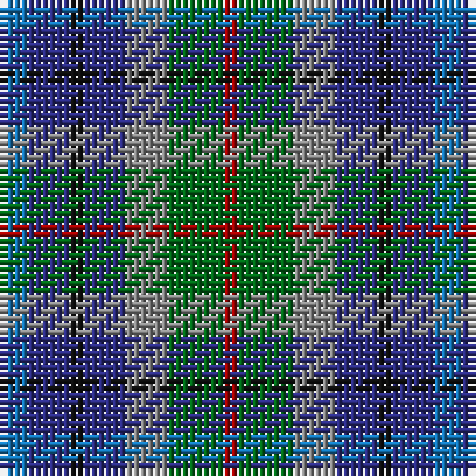

The parent of this is [New York City (District)](/tartans/b/4/db6/k2/db6/n6/g8/dr/2/)

This was sourced from tartans-authority.  It is a [7 stripes tartan](/stripes/stripes7/).

Original link http://www.tartansauthority.com/tartan-ferret/display/3812/

## Thread count
B/4 DB6 K2 DB6 N6 G8 DR/2

## Palette
Each colour and its ΔE from the base-6 reference it is a variant of.

| Colour | Shade | Base | ΔE (OKLab) |
|---|---|---|---|
| B |  `#1474B4` | B  | 0.15 |
| DB |  `#2C2C80` | B  | 0.05 |
| DR |  `#A00000` | R  | 0.09 |
| G |  `#006818` | G  | 0.02 |
| K |  `#101010` | K  | 0.17 |
| N |  `#888888` | R  | 0.24 |

# Sample pattern

ID: /variants/b/4/db6/k2/db6/n6/g8/dr/2-b1474b4-db2c2c80-dra00000-g006818-k101010-n888888/
