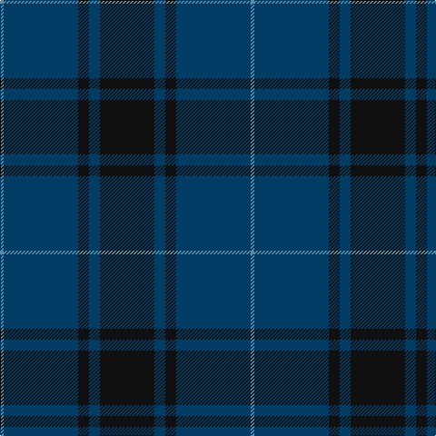

The parent of this is [Williams (New York) (Personal)](/tartans/b/4/db82/k12/db12/k/60/)

This was sourced from tartans-authority.  It is a [5 stripes tartan](/stripes/stripes5/).

Original link http://www.tartansauthority.com/tartan-ferret/display/10107/

## Thread count
B/4 DB82 K12 DB12 K/60

## Palette
Each colour and its ΔE from the base-6 reference it is a variant of.

| Colour | Shade | Base | ΔE (OKLab) |
|---|---|---|---|
| B |  `#5C8CA8` | B  | 0.23 |
| DB |  `#003C64` | B  | 0.07 |
| K |  `#101010` | K  | 0.17 |

# Sample pattern

ID: /variants/b/4/db82/k12/db12/k/60-b5c8ca8-db003c64-k101010/
