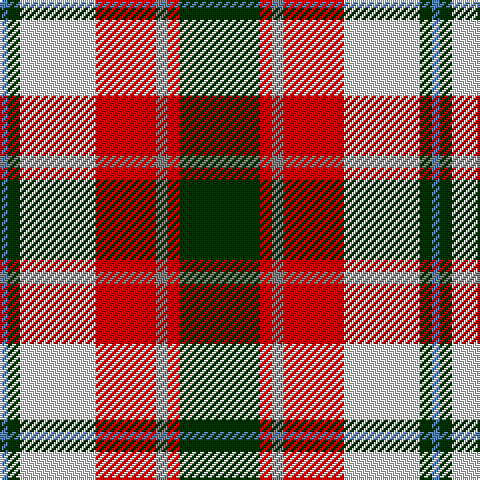

The parent of this is [Glasgow](/tartans/b/4/dg6/ln38/r30/n6/r6/dg/40/)

This was sourced from weddslist.  It is a [7 stripes tartan](/stripes/stripes7/).

Original link http://www.weddslist.com/cgi-bin/tartans/pg.pl?source=sts

## Thread count
B/4 DG6 LN38 R30 N6 R6 DG/40

## Palette
Each colour and its ΔE from the base-6 reference it is a variant of.

| Colour | Shade | Base | ΔE (OKLab) |
|---|---|---|---|
| B |  `#5480B0` | B  | 0.20 |
| DG |  `#003000` | G  | 0.18 |
| LN |  `#E0E0E0` | W  | 0.06 |
| N |  `#808080` | G  | 0.22 |
| R |  `#C00000` | R  | 0.02 |

# Sample pattern

ID: /variants/b/4/dg6/ln38/r30/n6/r6/dg/40-b5480b0-dg003000-lne0e0e0-n808080-rc00000/
