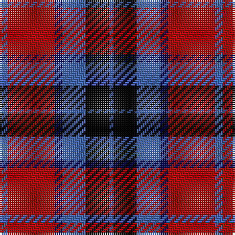

The parent of this is [MacTavish](/tartans/b/4/dr24/db4/b12/k12/b/2/)

This was sourced from weddslist.  It is a [6 stripes tartan](/stripes/stripes6/).

Original link http://www.weddslist.com/cgi-bin/tartans/pg.pl?source=x

## Thread count
B/4 DR24 DB4 B12 K12 B/2

## Palette
Each colour and its ΔE from the base-6 reference it is a variant of.

| Colour | Shade | Base | ΔE (OKLab) |
|---|---|---|---|
| B |  `#4367AE` | B  | 0.13 |
| DB |  `#000052` | B  | 0.20 |
| DR |  `#AA0000` | R  | 0.06 |
| K |  `#000000` | K  | 0.00 |

# Sample pattern

ID: /variants/b/4/dr24/db4/b12/k12/b/2-b4367ae-db000052-draa0000-k000000/
