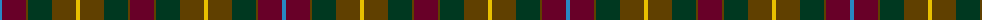

The parent of this is [United Distillers Corporate Tartan Tartan Number: 2098. Earliest known date: 1989 An expression of evocative Scottish colours to reflect the corporate image of quality and style. (weft) lb4 b24 lb2 dg24 g24 r4 See products available Copyright © Blair Urquhart, Comrie, 2015](/tartans/b/4/dr24/t2/dg24/t24/y4/t24/dg24/t2/dr/24/)

This was sourced from house-of-tartan.  It is a [10 stripes tartan](/stripes/stripes10/).

Original link http://www.house-of-tartan.scotland.net/house/TartanViewjs.asp?colr=Def&tnam=2098

## Thread count
B/4 DR24 T2 DG24 T24 Y4 T24 DG24 T2 DR/24

## Palette
Each colour and its ΔE from the base-6 reference it is a variant of.

| Colour | Shade | Base | ΔE (OKLab) |
|---|---|---|---|
| B |  `#2888C4` | B  | 0.21 |
| DB |  `#2C2C80` | B  | 0.05 |
| DG |  `#003820` | G  | 0.16 |
| DR |  `#680028` | B  | 0.20 |
| G |  `#006818` | G  | 0.02 |
| R |  `#C80000` | R  | 0.00 |
| T |  `#604000` | G  | 0.14 |
| Y |  `#E8C000` | Y  | 0.00 |

ID: /variants/b/4/dr24/t2/dg24/t24/y4/t24/dg24/t2/dr/24-b2888c4-db2c2c80-dg003820-dr680028-g006818-rc80000-t604000-ye8c000/
