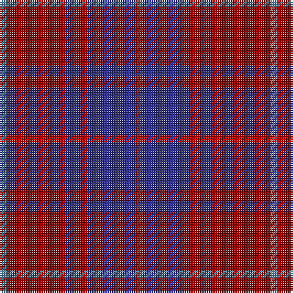

The parent of this is [MacArthur-Fox Dress Personal Tartan Tartan Number: 459. Earliest known date: 1986 This is the older of the two MacArthur setts, which links the clan with the Campbells. See products available Copyright © Blair Urquhart, Comrie, 2015](/tartans/b/4/dr32/db6/dr6/db26/r/4/)

This was sourced from house-of-tartan.  It is a [6 stripes tartan](/stripes/stripes6/).

Original link http://www.house-of-tartan.scotland.net/house/TartanViewjs.asp?colr=Def&tnam=459

## Thread count
B/4 DR32 DB6 DR6 DB26 R/4

## Palette
Each colour and its ΔE from the base-6 reference it is a variant of.

| Colour | Shade | Base | ΔE (OKLab) |
|---|---|---|---|
| B |  `#5C8CA8` | B  | 0.23 |
| DB |  `#2C2C80` | B  | 0.05 |
| DR |  `#880000` | R  | 0.14 |
| R |  `#C80000` | R  | 0.00 |

# Sample pattern

ID: /variants/b/4/dr32/db6/dr6/db26/r/4-b5c8ca8-db2c2c80-dr880000-rc80000/
