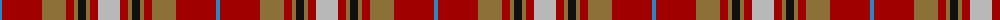

The parent of this is [Australia Dress (Fashion)](/tartans/b/4/dr40/lt24/dr8/lt4/k8/lt4/dr8/n/22/)

This was sourced from tartans-authority.  It is a [9 stripes tartan](/stripes/stripes9/).

Original link http://www.tartansauthority.com/tartan-ferret/display/612/

## Thread count
B/4 DR40 LT24 DR8 LT4 K8 LT4 DR8 N/22

## Palette
Each colour and its ΔE from the base-6 reference it is a variant of.

| Colour | Shade | Base | ΔE (OKLab) |
|---|---|---|---|
| B |  `#2888C4` | B  | 0.21 |
| DR |  `#A00000` | R  | 0.09 |
| K |  `#101010` | K  | 0.17 |
| LT |  `#8C7038` | G  | 0.18 |
| N |  `#B8B8B8` | Y  | 0.17 |

ID: /variants/b/4/dr40/lt24/dr8/lt4/k8/lt4/dr8/n/22-b2888c4-dra00000-k101010-lt8c7038-nb8b8b8/
