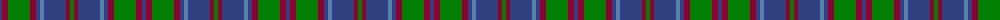

The parent of this is [Hebridean 1](/tartans/b/4/dr6/g22/dr6/b4/ba4/b22/dr4/g/4/)

This was sourced from weddslist.  It is a [9 stripes tartan](/stripes/stripes9/).

Original link http://www.weddslist.com/cgi-bin/tartans/pg.pl?source=sts

## Thread count
B/4 DR6 G22 DR6 B4 Ba4 B22 DR4 G/4

## Palette
Each colour and its ΔE from the base-6 reference it is a variant of.

| Colour | Shade | Base | ΔE (OKLab) |
|---|---|---|---|
| B |  `#304080` | B  | 0.01 |
| Ba |  `#5480B0` | B  | 0.20 |
| DR |  `#900030` | R  | 0.13 |
| G |  `#008000` | G  | 0.09 |

ID: /variants/b/4/dr6/g22/dr6/b4/ba4/b22/dr4/g/4-b304080-ba5480b0-dr900030-g008000/
