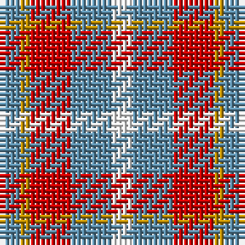

The parent of this is [Doohan (Name)](/tartans/b/4/dy2/r8/b8/w/4/)

This was sourced from tartans-authority.  It is a [5 stripes tartan](/stripes/stripes5/).

Original link http://www.tartansauthority.com/tartan-ferret/display/10759/

## Thread count
B/4 DY2 R8 B8 W/4

## Palette
Each colour and its ΔE from the base-6 reference it is a variant of.

| Colour | Shade | Base | ΔE (OKLab) |
|---|---|---|---|
| B |  `#5C8CA8` | B  | 0.23 |
| DY |  `#BC8C00` | Y  | 0.16 |
| R |  `#C80000` | R  | 0.00 |
| W |  `#FCFCFC` | W  | 0.03 |

# Sample pattern

ID: /variants/b/4/dy2/r8/b8/w/4-b5c8ca8-dybc8c00-rc80000-wfcfcfc/
