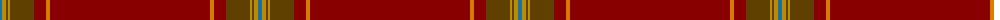

The parent of this is [Alegre-Wood (Personal)](/tartans/b/4/dy4/t2/dy2/t24/dr12/o4/dr/160/)

This was sourced from tartans-authority.  It is a [8 stripes tartan](/stripes/stripes8/).

Original link http://www.tartansauthority.com/tartan-ferret/display/7698/

## Thread count
B/4 DY4 T2 DY2 T24 DR12 O4 DR/160

## Palette
Each colour and its ΔE from the base-6 reference it is a variant of.

| Colour | Shade | Base | ΔE (OKLab) |
|---|---|---|---|
| B |  `#1870A4` | B  | 0.14 |
| DR |  `#880000` | R  | 0.14 |
| DY |  `#BC8C00` | Y  | 0.16 |
| O |  `#D87C00` | Y  | 0.17 |
| T |  `#604000` | G  | 0.14 |

# Sample pattern

ID: /variants/b/4/dy4/t2/dy2/t24/dr12/o4/dr/160-b1870a4-dr880000-dybc8c00-od87c00-t604000/
