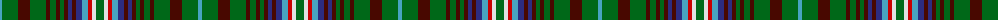

The parent of this is [Missouri (Proposed)](/tartans/b/4/g16/dr12/g16/dr4/g6/dr4/g4/dr4/db4/dr4/db6/b6/r4/ln4/g/8/)

This was sourced from tartans-authority.  It is a [16 stripes tartan](/stripes/stripes16/).

Original link http://www.tartansauthority.com/tartan-ferret/display/8435/

## Thread count
B/4 G16 DR12 G16 DR4 G6 DR4 G4 DR4 DB4 DR4 DB6 B6 R4 LN4 G/8

## Palette
Each colour and its ΔE from the base-6 reference it is a variant of.

| Colour | Shade | Base | ΔE (OKLab) |
|---|---|---|---|
| B |  `#48A4C0` | Y  | 0.28 |
| DB |  `#2C2C80` | B  | 0.05 |
| DR |  `#480800` | B  | 0.23 |
| G |  `#006818` | G  | 0.02 |
| LN |  `#E0E0E0` | W  | 0.06 |
| R |  `#C80000` | R  | 0.00 |

ID: /variants/b/4/g16/dr12/g16/dr4/g6/dr4/g4/dr4/db4/dr4/db6/b6/r4/ln4/g/8-b48a4c0-db2c2c80-dr480800-g006818-lne0e0e0-rc80000/
