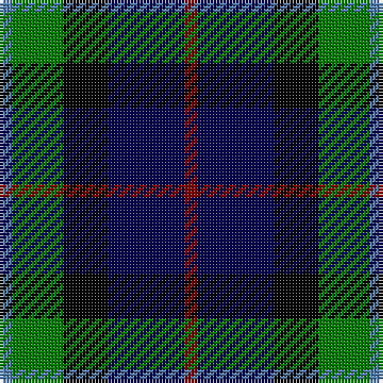

The parent of this is [Forbo Nairn](/tartans/b/4/g16/k14/db24/dr/4/)

This was sourced from weddslist.  It is a [5 stripes tartan](/stripes/stripes5/).

Original link http://www.weddslist.com/cgi-bin/tartans/pg.pl?source=sts

## Thread count
B/4 G16 K14 DB24 DR/4

## Palette
Each colour and its ΔE from the base-6 reference it is a variant of.

| Colour | Shade | Base | ΔE (OKLab) |
|---|---|---|---|
| B |  `#5480B0` | B  | 0.20 |
| DB |  `#000050` | B  | 0.20 |
| DR |  `#800000` | R  | 0.16 |
| G |  `#008000` | G  | 0.09 |
| K |  `#000000` | K  | 0.00 |

# Sample pattern

ID: /variants/b/4/g16/k14/db24/dr/4-b5480b0-db000050-dr800000-g008000-k000000/
