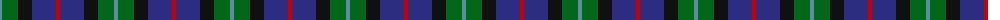
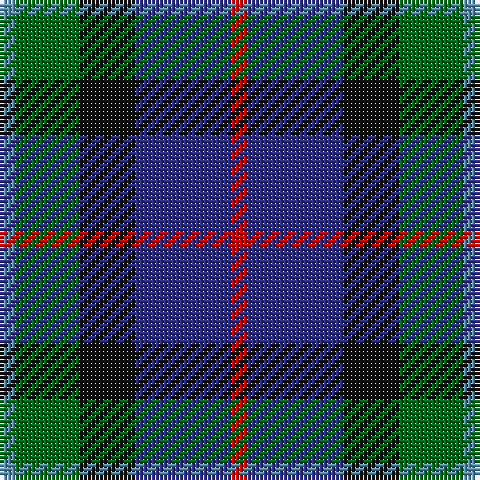

The parent of this is [Forbo Nairn (Corporate)](/tartans/b/4/g16/k14/db24/r/4/)

This was sourced from tartans-authority.  It is a [5 stripes tartan](/stripes/stripes5/).

Original link http://www.tartansauthority.com/tartan-ferret/display/2298/

## Thread count
B/4 G16 K14 DB24 R/4

## Palette
Each colour and its ΔE from the base-6 reference it is a variant of.

| Colour | Shade | Base | ΔE (OKLab) |
|---|---|---|---|
| B |  `#5C8CA8` | B  | 0.23 |
| DB |  `#2C2C80` | B  | 0.05 |
| G |  `#006818` | G  | 0.02 |
| K |  `#101010` | K  | 0.17 |
| R |  `#C80000` | R  | 0.00 |

# Sample pattern

ID: /variants/b/4/g16/k14/db24/r/4-b5c8ca8-db2c2c80-g006818-k101010-rc80000/
