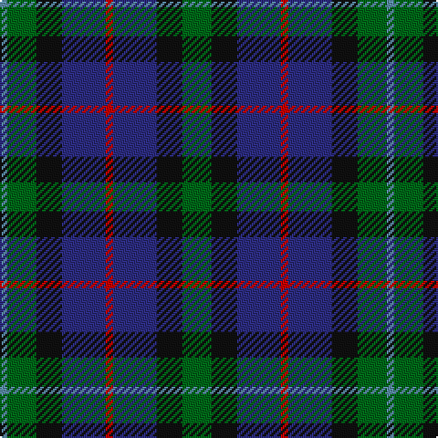

The parent of this is [Forbo Nairn Corporate Tartan Tartan Number: 2298. Earliest known date: pre 2002 Designed for Forbo Nairn Ltd - a Swiss based company with two factories in Kirkcaldy, Fife. Tartan is based on the Nairn (#1331) because of an association with Michael Nairn, builder of the first 'floor cloth' (linoleum) factory in Scotland in 1843.STS said Approved by Sir Robert Spencer Nairn. Blue and red used in this graphic in place of dark blue and red so that sett could be seen. See products available Copyright © Blair Urquhart, Comrie, 2015](/tartans/b/4/g16/k14/db24/r4/db24/k14/g/16/)

This was sourced from house-of-tartan.  It is a [8 stripes tartan](/stripes/stripes8/).

Original link http://www.house-of-tartan.scotland.net/house/TartanViewjs.asp?colr=Def&tnam=2298

## Thread count
B/4 G16 K14 DB24 R4 DB24 K14 G/16

## Palette
Each colour and its ΔE from the base-6 reference it is a variant of.

| Colour | Shade | Base | ΔE (OKLab) |
|---|---|---|---|
| B |  `#5C8CA8` | B  | 0.23 |
| DB |  `#2C2C80` | B  | 0.05 |
| DBa |  `#202060` | B  | 0.11 |
| DR |  `#880000` | R  | 0.14 |
| G |  `#006818` | G  | 0.02 |
| K |  `#101010` | K  | 0.17 |
| R |  `#C80000` | R  | 0.00 |

# Sample pattern

ID: /variants/b/4/g16/k14/db24/r4/db24/k14/g/16-b5c8ca8-db2c2c80-dba202060-dr880000-g006818-k101010-rc80000/
