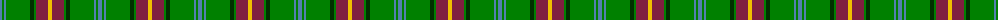
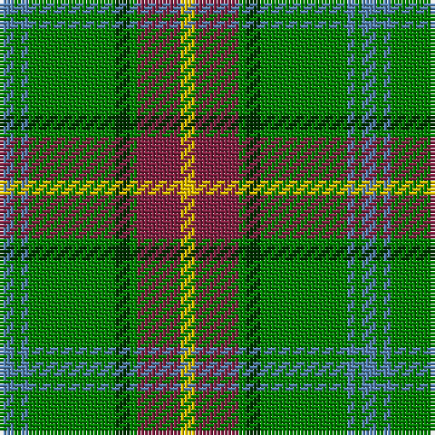

The parent of this is [Manitoba](/tartans/b/4/g2/b2/g24/dg4/g2/dr12/y/4/)

This was sourced from weddslist.  It is a [8 stripes tartan](/stripes/stripes8/).

Original link http://www.weddslist.com/cgi-bin/tartans/pg.pl?source=sts

## Thread count
B/4 G2 B2 G24 DG4 G2 DR12 Y/4

## Palette
Each colour and its ΔE from the base-6 reference it is a variant of.

| Colour | Shade | Base | ΔE (OKLab) |
|---|---|---|---|
| B |  `#5480B0` | B  | 0.20 |
| DG |  `#003000` | G  | 0.18 |
| DR |  `#802040` | R  | 0.16 |
| G |  `#008000` | G  | 0.09 |
| Y |  `#F0C000` | Y  | 0.01 |

# Sample pattern

ID: /variants/b/4/g2/b2/g24/dg4/g2/dr12/y/4-b5480b0-dg003000-dr802040-g008000-yf0c000/
