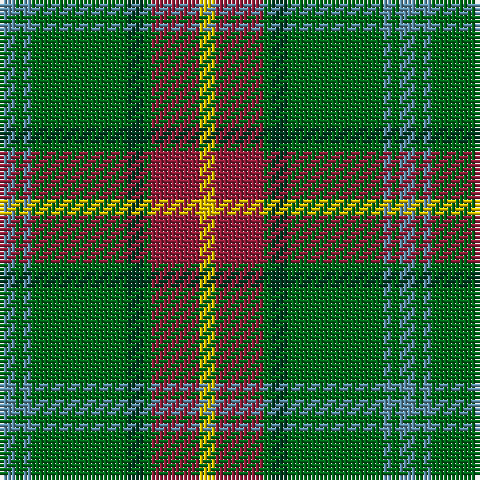

The parent of this is [Manitoba District Tartan Tartan Number: 144. Earliest known date: 1962 The official recording of the sett shows the letter G for the dark green stripe. In heraldic terms this means 'Gules' - red. The designer, Hugh Kirkwood Rankine, clearly intended dark green and this is reproduced here.It was given Royal Assent in 1962. See products available Copyright © Blair Urquhart, Comrie, 2015](/tartans/b/4/g2/b2/g24/dg4/g2/dr12/y/4/)

This was sourced from house-of-tartan.  It is a [8 stripes tartan](/stripes/stripes8/).

Original link http://www.house-of-tartan.scotland.net/house/TartanViewjs.asp?colr=Def&tnam=144

## Thread count
B/4 G2 B2 G24 DG4 G2 DR12 Y/4

## Palette
Each colour and its ΔE from the base-6 reference it is a variant of.

| Colour | Shade | Base | ΔE (OKLab) |
|---|---|---|---|
| B |  `#5C8CA8` | B  | 0.23 |
| DG |  `#003820` | G  | 0.16 |
| DR |  `#901C38` | R  | 0.12 |
| G |  `#006818` | G  | 0.02 |
| Y |  `#E8C000` | Y  | 0.00 |

# Sample pattern

ID: /variants/b/4/g2/b2/g24/dg4/g2/dr12/y/4-b5c8ca8-dg003820-dr901c38-g006818-ye8c000/
