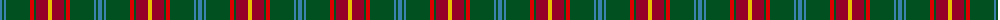
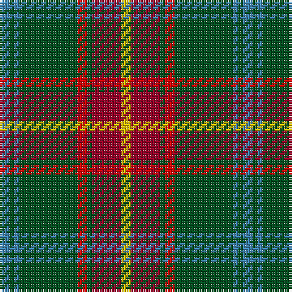

The parent of this is [Manitoba Red](/tartans/b/4/g2/b2/g24/r4/g2/dr12/y/4/)

This was sourced from register-of-tartans.  It is a [8 stripes tartan](/stripes/stripes8/).

Original link https://www.tartanregister.gov.uk/tartanDetails.aspx?ref=2808

## Thread count
B/4 G2 B2 G24 R4 G2 DR12 Y/4

## Palette
Each colour and its ΔE from the base-6 reference it is a variant of.

| Colour | Shade | Base | ΔE (OKLab) |
|---|---|---|---|
| B |  `#3C82AF` | B  | 0.20 |
| DR |  `#960028` | R  | 0.11 |
| G |  `#005020` | G  | 0.08 |
| R |  `#DC0000` | R  | 0.04 |
| Y |  `#E8C000` | Y  | 0.00 |

# Sample pattern

ID: /variants/b/4/g2/b2/g24/r4/g2/dr12/y/4-b3c82af-dr960028-g005020-rdc0000-ye8c000/
