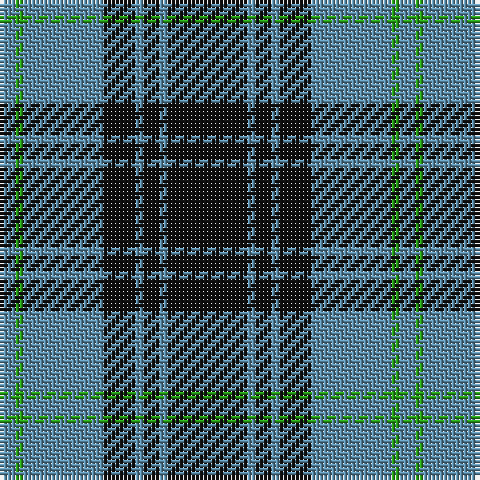

The parent of this is [Martin's Own (Personal)](/tartans/b/4/g2/b20/k8/b2/k4/b2/k/20/)

This was sourced from tartans-authority.  It is a [8 stripes tartan](/stripes/stripes8/).

Original link http://www.tartansauthority.com/tartan-ferret/display/6590/

## Thread count
B/4 G2 B20 K8 B2 K4 B2 K/20

## Palette
Each colour and its ΔE from the base-6 reference it is a variant of.

| Colour | Shade | Base | ΔE (OKLab) |
|---|---|---|---|
| B |  `#5C8CA8` | B  | 0.23 |
| G |  `#289C18` | G  | 0.18 |
| K |  `#101010` | K  | 0.17 |

# Sample pattern

ID: /variants/b/4/g2/b20/k8/b2/k4/b2/k/20-b5c8ca8-g289c18-k101010/
