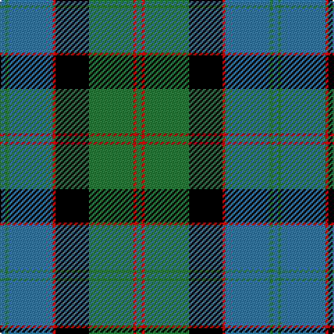

The parent of this is [Lochaber District](/tartans/b/4/g2/b32/r2/k24/g32/r2/g/4/)

This was sourced from weddslist.  It is a [8 stripes tartan](/stripes/stripes8/).

Original link http://www.weddslist.com/cgi-bin/tartans/pg.pl?source=rb

## Thread count
B/4 G2 B32 R2 K24 G32 R2 G/4

## Palette
Each colour and its ΔE from the base-6 reference it is a variant of.

| Colour | Shade | Base | ΔE (OKLab) |
|---|---|---|---|
| B |  `#3C779D` | B  | 0.16 |
| G |  `#2D783E` | G  | 0.08 |
| K |  `#000000` | K  | 0.00 |
| R |  `#C80000` | R  | 0.00 |

# Sample pattern

ID: /variants/b/4/g2/b32/r2/k24/g32/r2/g/4-b3c779d-g2d783e-k000000-rc80000/
