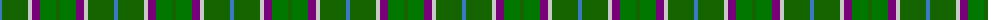
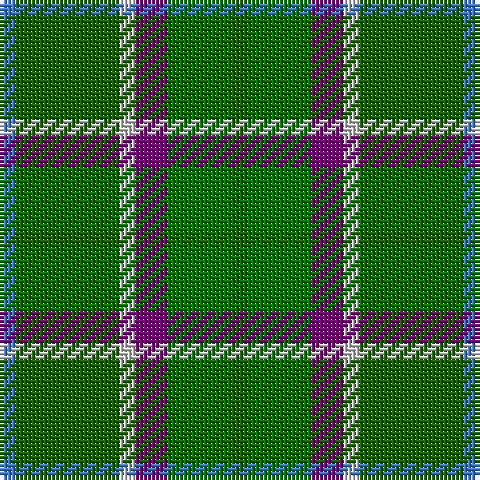

The parent of this is [Ellan Vannin](/tartans/b/4/g26/n4/p8/ga16/g/4/)

This was sourced from register-of-tartans.  It is a [6 stripes tartan](/stripes/stripes6/).

Original link https://www.tartanregister.gov.uk/tartanDetails.aspx?ref=1099

## Thread count
B/4 G26 N4 P8 Ga16 G/4

## Palette
Each colour and its ΔE from the base-6 reference it is a variant of.

| Colour | Shade | Base | ΔE (OKLab) |
|---|---|---|---|
| B |  `#3C78C8` | B  | 0.18 |
| G |  `#146400` | G  | 0.01 |
| Ga |  `#007800` | G  | 0.06 |
| N |  `#C8C8C8` | W  | 0.13 |
| P |  `#780078` | B  | 0.16 |

# Sample pattern

ID: /variants/b/4/g26/n4/p8/ga16/g/4-b3c78c8-g146400-ga007800-nc8c8c8-p780078/
