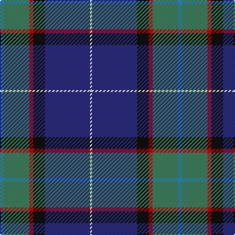

The parent of this is [Gamblin Thompson (Personal)](/tartans/b/4/g26/r4/k12/db46/w/2/)

This was sourced from tartans-authority.  It is a [6 stripes tartan](/stripes/stripes6/).

Original link http://www.tartansauthority.com/tartan-ferret/display/6195/

## Thread count
B/4 G26 R4 K12 DB46 W/2

## Palette
Each colour and its ΔE from the base-6 reference it is a variant of.

| Colour | Shade | Base | ΔE (OKLab) |
|---|---|---|---|
| B |  `#2888C4` | B  | 0.21 |
| DB |  `#2C2C80` | B  | 0.05 |
| G |  `#408060` | G  | 0.13 |
| K |  `#101010` | K  | 0.17 |
| R |  `#C80000` | R  | 0.00 |
| W |  `#FCFCFC` | W  | 0.03 |

# Sample pattern

ID: /variants/b/4/g26/r4/k12/db46/w/2-b2888c4-db2c2c80-g408060-k101010-rc80000-wfcfcfc/
