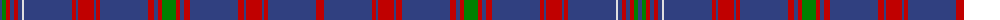

The parent of this is [Hebridean, South Uist Specimen](/tartans/b/4/g4/r4/b4/r4/b4/ln2/b48/r4/b2/r16/b2/r4/b48/r6/b4/r4/g14/r4/b4/r6/b48/r6/b2/r16/b2/r4/b48/r/8/)

This was sourced from weddslist.  It is a [29 stripes tartan](/stripes/stripes29/).

Original link http://www.weddslist.com/cgi-bin/tartans/pg.pl?source=sts

## Thread count
B/4 G4 R4 B4 R4 B4 LN2 B48 R4 B2 R16 B2 R4 B48 R6 B4 R4 G14 R4 B4 R6 B48 R6 B2 R16 B2 R4 B48 R/8

## Palette
Each colour and its ΔE from the base-6 reference it is a variant of.

| Colour | Shade | Base | ΔE (OKLab) |
|---|---|---|---|
| B |  `#304080` | B  | 0.01 |
| G |  `#008000` | G  | 0.09 |
| LN |  `#E0E0E0` | W  | 0.06 |
| R |  `#C00000` | R  | 0.02 |

ID: /variants/b/4/g4/r4/b4/r4/b4/ln2/b48/r4/b2/r16/b2/r4/b48/r6/b4/r4/g14/r4/b4/r6/b48/r6/b2/r16/b2/r4/b48/r/8-b304080-g008000-lne0e0e0-rc00000/
