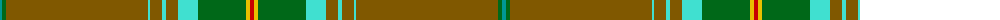

The parent of this is [Original Tartan Ltd (Corporate)](/tartans/b/4/g4/t142/ba2/t12/ba4/t12/ba20/g48/y4/r/4/)

This was sourced from tartans-authority.  It is a [11 stripes tartan](/stripes/stripes11/).

Original link http://www.tartansauthority.com/tartan-ferret/display/8010/

## Thread count
B/4 G4 T142 Ba2 T12 Ba4 T12 Ba20 G48 Y4 R/4

## Palette
Each colour and its ΔE from the base-6 reference it is a variant of.

| Colour | Shade | Base | ΔE (OKLab) |
|---|---|---|---|
| B |  `#009894` | G  | 0.21 |
| Ba |  `#40E0D0` | W  | 0.19 |
| G |  `#006818` | G  | 0.02 |
| R |  `#C80000` | R  | 0.00 |
| T |  `#805800` | G  | 0.15 |
| Y |  `#E8C000` | Y  | 0.00 |

ID: /variants/b/4/g4/t142/ba2/t12/ba4/t12/ba20/g48/y4/r/4-b009894-ba40e0d0-g006818-rc80000-t805800-ye8c000/
