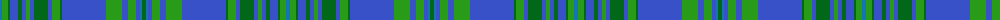

The parent of this is [Wiregrass (District)](/tartans/b/4/g6/ga2/ba8/ga4/ba4/g4/ba4/ga14/ba4/g8/ga2/ba44/g16/ba6/g8/ba4/b2/ga/4/)

This was sourced from tartans-authority.  It is a [19 stripes tartan](/stripes/stripes19/).

Original link http://www.tartansauthority.com/tartan-ferret/display/8521/

## Thread count
B/4 G6 Ga2 Ba8 Ga4 Ba4 G4 Ba4 Ga14 Ba4 G8 Ga2 Ba44 G16 Ba6 G8 Ba4 B2 Ga/4

## Palette
Each colour and its ΔE from the base-6 reference it is a variant of.

| Colour | Shade | Base | ΔE (OKLab) |
|---|---|---|---|
| B |  `#1474B4` | B  | 0.15 |
| Ba |  `#3850C8` | B  | 0.12 |
| G |  `#289C18` | G  | 0.18 |
| Ga |  `#006818` | G  | 0.02 |

ID: /variants/b/4/g6/ga2/ba8/ga4/ba4/g4/ba4/ga14/ba4/g8/ga2/ba44/g16/ba6/g8/ba4/b2/ga/4-b1474b4-ba3850c8-g289c18-ga006818/
